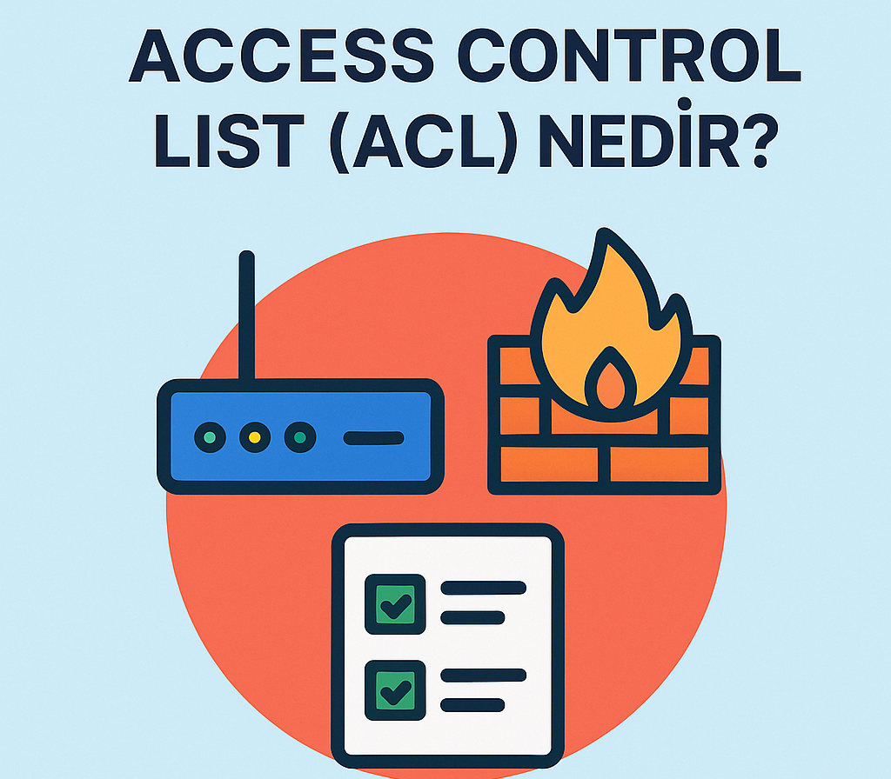
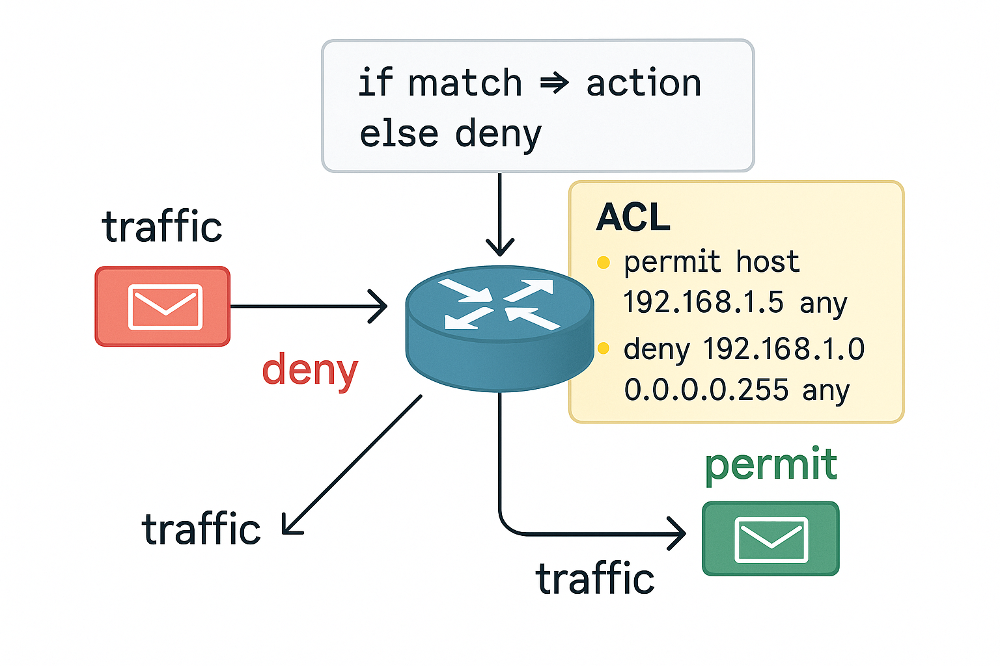
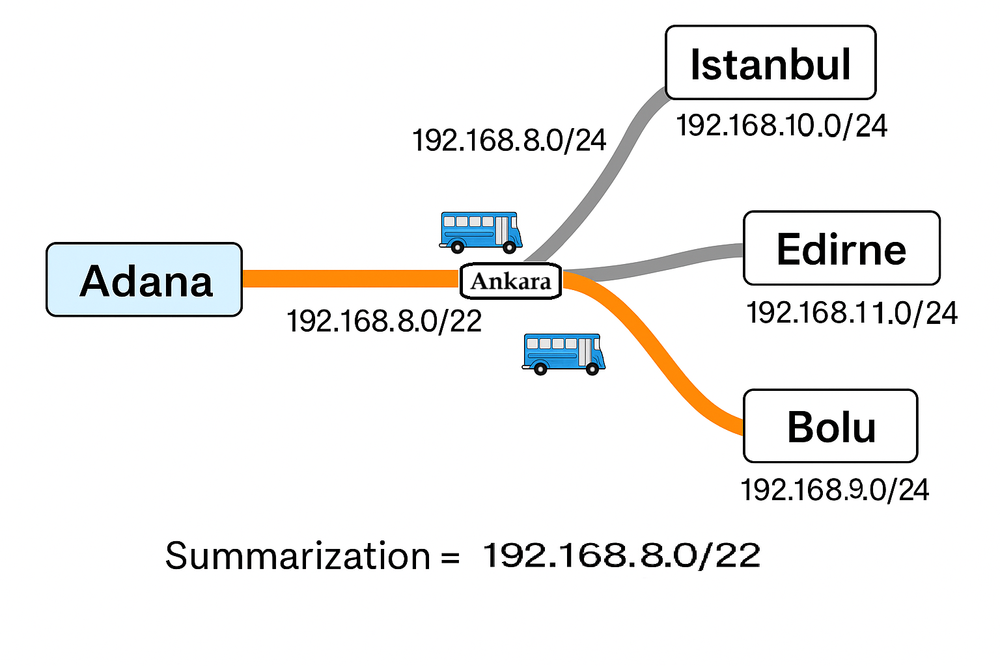

# ACL'ler Artık Kabusunuz Değil: IP Filtrelemeyi Basit Benzetmelerle Anlayın

Bu depo, ağ güvenliğinin temel taşlarından biri olan **Access Control List (ACL)** kavramlarını derinlemesine inceleyen kapsamlı bir rehber sunmaktadır. Bu rehber, ağ trafiğini filtreleme ve kaynaklara erişimi yönetme konularında hem teorik hem de pratik bilgiler sunar.



**İçindekiler:**
* [Access Control List (ACL) Nedir?](#access-control-list-acl-nedir)
* [ACL Nasıl Çalışır?](#acl-nasıl-çalışır)
* [ACL Türleri](#acl-türleri)
    * [Standart ACL](#1-standart-acl)
    * [Extended ACL](#2-extended-acl)
    * [Named ACL](#3-named-acl)
* [ACL Yazım Kuralları](#acl-yazım-kuralları)
    * [ACL Yazarken 3 Temel Soru](#acl-yazarken-3-temel-soru)
* [Günlük Hayattan Benzetme: “Bir Davete Gidiyorsunuz…”](#günlük-hayattan-benzetme-bir-davete-gidiyorsunuz)
* [ACL'leri Router Arayüzlerine Uygulama](#aclleri-router-arayüzlerine-uygulama)
* [Kural Sıralaması: “Önce Özel, Sonra Genel”](#kural-sıralaması-önce-özel-sonra-genel)
* [Subnet Maskesi ve Wildcard Maskesi (ACL Bağlantılı Açıklama)](#subnet-maskesi-ve-wildcard-maskesi-acl-bağlantılı-açıklama)
* [ACL Summarization (Kural Özetleme)](#acl-summarization-kural-özetleme-bitlerin-akıllı-dansı-ve-otobüs-güzergahı-benzetmesi)
* [İleri Seviye Bilgi: ACL'lerde Gelişmiş Kullanımlar](#ileri-seviye-bilgi-aclerde-gelişmiş-kullanımlar)
    * [Lock and Key (Dinamik ACL’ler)](#lock-and-key-dinamik-acller)
    * [Reflexive ACL (Yansıtmalı Erişim Listeleri)](#reflexive-acl-yansıtmalı-erişim-listeleri)
    * [Time-Based ACL (Zaman Tabanlı ACL)](#time-based-acl-zaman-tabanlı-acl)
    * [ACL Sorun Giderme](#ipucu-acl-sorun-giderme)
* [Packet Tracer Uygulaması Anlatımı](#packetTracer)
* [Sonuç](#sonuç)
* [Kaynaklar](#kaynaklar)

**Nasıl Okunur/Kullanılır:**
* Makalenin tam metni bu depodaki `README.md` dosyasının kendisi içerisinde bulunmaktadır.
* [isteğe bağlı: Cisco Packet Tracer uygulama dosyası (`.pkt` uzantılı) bu depoda mevcuttur. Uygulamayı incelemek için [Cisco Packet Tracer](https://www.netacad.com/courses/packet-tracer) yazılımına ihtiyacınız olacaktır.]

---

# 🎯 Access Control List (ACL) Nedir?

Access Control List (ACL), ağ trafiğini filtrelemek için kullanılan kurallar bütünüdür. Router veya güvenlik duvarı gibi cihazlarda, belirli paketlerin geçişine izin verir (permit) veya engeller (deny).

**ACL'lerin temel amaçları:**

- Ağ güvenliğini artırmak  
- Kaynakları korumak  
- Ağ performansını optimize etmek

---

## 🧭 ACL Nasıl Çalışır?
Peki, bu kurallar bir ağ cihazında tam olarak nasıl işler?

ACL'ler, gelen (inbound) veya giden (outbound) trafiğe uygulanabilir. Bir paket ACL'den geçtiğinde, kurallar yukarıdan aşağıya sırayla kontrol edilir ve paket, ilk eşleştiği kurala göre işlenir. Eşleşme sağlanınca, listenin geri kalanına bakılmaz.


> **📌 Kritik Bilgi:**  
> Her ACL'in sonunda sizin yazmadığınız ancak otomatik olarak var olan bir "implicit deny any" (varsayılan olarak her şeyi reddet) kuralı bulunur. Bu kural, listedeki hiçbir kurala uymayan tüm trafiğin engelleneceği anlamına gelir. Bu yüzden, izin vermek istediğiniz trafiği açıkça `permit` komutuyla belirtmelisiniz.  
>  
> **⚠️ Not:** Kuralların sırası hayati önem taşır: Daha spesifik kurallar üstte, daha genel kurallar altta olmalıdır.

---

## 🔍 ACL Türleri

ACL'ler, farklı ihtiyaçlara ve filtreleme detaylarına göre çeşitli türlere ayrılır. Üç ana ACL türü bulunur: Standart, Extended ve Named. Her birinin farklı yetenekleri ve kullanım alanları vardır.

### 🟠 1. Standart ACL

- **Numara Aralığı:** 1–99 veya 1300–1999  
- **Kontrol Edilen:** Sadece kaynak IP adresi. Bir paketin nereden geldiğine bakar.  
- **Uygulama Yeri:** Genellikle hedefe yakın (outbound) uygulanır. Çünkü yalnızca kaynak IP'yi filtreleyebildiği için, paketin hedefinin ne olduğunu öğrendikten sonra engellemek daha mantıklıdır.  
- **Avantajı:** Basit yapısıyla hızlıca tanımlanabilir.  
- **Dezavantajı:** Detaylı filtreleme yapamaz, sadece kaynağa göre hareket eder.

### 🔵 2. Extended ACL

- **Numara Aralığı:** 100–199 veya 2000–2699  
- **Kontrol Edilen:** Çok daha detaylı filtreleme sunar: kaynak IP, hedef IP, protokol (TCP, UDP, ICMP vb.), kaynak port numarası ve hedef port numarası.  
- **Uygulama Yeri:** Genellikle kaynağa yakın (inbound) uygulanır. Detaylı filtreleme yeteneği sayesinde gereksiz trafiği ağa girmeden, yani mümkün olan en erken noktada engeller. Bu, ağ performansını ciddi şekilde artırır.  
- **Avantajı:** Belirli bir uygulamayı veya servisi hedefleyerek çok hassas kontrol sağlar.  
- **Dezavantajı:** Yapılandırması standart ACL'lere göre daha karmaşıktır.

### 🟢 3. Named ACL

- **Tanımı:** Numara yerine bir isimle tanımlanan ACL türüdür (hem standart hem de extended olabilir).  
- **Avantajları:**  
    - Daha okunabilir: Sayısal değerler yerine anlamlı isimler kullanılması, yönetimi kolaylaştırır.  
    - Daha kolay düzenlenebilir: Sayı tabanlı ACL'lerde kural ekleme veya silme zorluyken, Named ACL'lerde kurallara otomatik olarak numaralar atanır ve siz istediğiniz sıraya yeni kurallar ekleyebilirsiniz. Bu, ACL'leri dinamik ve esnek hale getirir.

---

## 🛠️ ACL Yazım Kuralları
ACL tanımlarken, kuralların etkinliği için belirli noktalara dikkat etmek gerekir:

**✅ Önemli Noktalar:**

- **Sıra Önemlidir:** ACL'ler yukarıdan aşağıya doğru okunur ve ilk eşleşen kural uygulanır. Bu yüzden, tek bir IP adresi gibi daha spesifik kurallar, bir ağ bloğu gibi daha genel kurallardan önce gelmelidir.  
- **Tekli IP Adresi Belirtme:** Tek bir IP adresini hedeflemek için `host` anahtar kelimesini kullanırız. Örneğin: `permit ip host 192.168.1.10 any`. Bu, wildcard mask yazmaktan daha basittir.  
- **Wildcard Mask:** Bir ağ bloğunu belirtmek için kullanılır. Örneğin, `192.168.1.0 0.0.0.255` ifadesi bir /24 alt ağı (192.168.1.0 - 192.168.1.255 arasındaki tüm adresleri) temsil eder. Wildcard mask'teki '0'lar ilgili bitin tam eşleşmesi gerektiğini, '1'ler ise herhangi bir değere sahip olabileceğini gösterir.  
- **Varsayılan Kural (`deny any any`):** Unutmayın, her ACL'in sonunda görünmez bir `deny any any` kuralı vardır. Bu nedenle, izin vermek istediğiniz tüm trafiği açıkça `permit` komutuyla belirtmeniz şarttır.

---

### 🧠 ACL Yazarken 3 Temel Soru

ACL tanımlarken şu üç soruyu kendine sormalısın:

| Soru         | Açıklama                                                         | Örnek                                   |
|--------------|------------------------------------------------------------------|------------------------------------------|
| **Neyi?**     | Hangi trafik için kural yazıyorsun? (IP, protokol, port vb.)    | `permit tcp host 192.168.1.10 any eq 80` |
| **Nerede?**   | Hangi router veya arayüzde uygulayacaksın?                      | Sınır yönlendiricide, dış arayüzde       |
| **Ne zaman?** | Trafik girişte mi yoksa çıkışta mı kontrol edilecek? (`in/out`) | `ip access-group 100 in`                 |


> 🔑 **Bu sıralama önemlidir:**  
> Doğru trafik → doğru cihaz → doğru yön  
> Yanlış yönde uygulanan doğru ACL bile işe yaramaz.

---

## 🚍 Günlük Hayattan Benzetme: “Bir Davete Gidiyorsunuz…”

ACL'lerin karmaşık yapısını daha iyi kavramak için, gelin günlük hayattan basit bir senaryoya göz atalım: Bir davete otobüslerle gidiş senaryosu üzerinden ACL'lerin nasıl çalıştığını açıklayalım.

### 🔸 Standart ACL – “Davet Girişinde Kimlik Kontrolü”

- Otobüse biner ve davet alanına kadar gidersiniz. Kapıdaki görevli sadece kim olduğunuzu (kaynak IP'niz) kontrol eder. Davetli değilseniz veya adınız listede yoksa (varsayılan reddetme kuralı), kapıdan geri çevrilirsiniz.  
- **Sonuç:** Davetli olmasanız bile o kadar yolu boşuna gitmiş, otobüsü ve yolu gereksiz yere meşgul etmiş olursunuz. Bu, ağda gereksiz yere ilerleyen ve bant genişliği harcayan trafiği temsil eder.

### 🔹 Extended ACL – “Otobüse Binerken Detaylı Kontrol”

- Bu sefer kontrol otobüse binmeden önce, yani kaynağa çok yakın bir yerde yapılır. Sadece kim olduğunuz değil (kaynak IP), nereye gideceğiniz (hedef IP), ne için gittiğiniz (protokol) ve biniş saatiniz gibi detaylı bilgiler (port numarası) kontrol edilir.  
- Davetli değilseniz veya kurallara uymuyorsanız (örneğin, davete uygun olmayan bir ulaşım şekliyle geliyorsanız), direkt otobüse alınmazsınız.  
- **Sonuç:** Trafik hiç yola çıkmaz, gereksiz ağ yükü ve kaynak israfı önlenir. Ağ performansı artar.  
- **Dikkat:** Ancak yanlış bir kural tanımlanmışsa, davet harici bir yere gidişinizde bile (örneğin, başka bir durakta inmek istiyorsanız) otobüse alınmayabilirsiniz. Bu nedenle, yanlış yapılandırılmış bir Extended ACL meşru trafiği de engelleyebilir.

### 🟩 Named ACL – “İsimli Davet Listesi”

- Davet listesine "Önemli Misafirler Listesi" gibi bir isim veririz. Tüm kurallar bu isimli listenin içinde yer alır.  
- Yeni kişileri (yeni kuralları) listeye eklerken, sayısal sıralamayı dert etmeden istediğiniz araya (belirli bir numaraya) kolayca ekleyebilirsiniz. Bu, davetli listesini yönetmeyi ve güncelleştirmeyi çok daha basit ve esnek hale getirir.

---

## ⚙️ ACL'leri Router Arayüzlerine Uygulama

ACL'ler router arayüzlerine inbound veya outbound olarak uygulanır. Performans açısından, trafiği mümkün olan en erken noktada filtrelemek genellikle en iyisidir.

| ACL Türü       | Uygulama Yeri         | Neden?                                                                                   |
|----------------|-----------------------|------------------------------------------------------------------------------------------|
| Standart ACL   | Hedefe Yakın (Outbound)| Sadece kaynak IP'ye bakar, paketin hedefine ulaştığı veya çıkacağı noktada filtrelemek daha uygun olabilir. |
| Extended ACL   | Kaynağa Yakın (Inbound)| Detaylı filtreleme yapar, gereksiz trafiği ağa girmeden veya yolculuğunun başında engellemek performansı artırır. |

---

## 📌 Kural Sıralaması: “Önce Özel, Sonra Genel”

Bir ACL'deki kural sıralaması hayati öneme sahiptir.

**Örnek:**

```bash
access-list 100 permit ip host 192.168.1.5 any  # Çok spesifik: Sadece bu IP'ye izin ver
access-list 100 deny ip 192.168.1.0 0.0.0.255 any # Genel: Bu ağdaki diğer herkesi engelle
```
Eğer bu sıralama ters olursa, yani genel deny kuralı özel permit kuralından önce gelirse, 192.168.1.5 IP adresine sahip cihaz da engellenir. Çünkü paket, listenin en tepesindeki genel kurala takılır ve devamına bakılmaz.

### 📊 ACL Türleri Karşılaştırma Tablosu

| Özellik                | Standart ACL                         | Extended ACL                                                    | Named ACL                                                |
|------------------------|--------------------------------------|------------------------------------------------------------------|----------------------------------------------------------|
| **Filtreleme Kriteri** | Sadece Kaynak IP                     | Kaynak IP, Hedef IP, Protokol, Port                             | Hem Standart hem Extended olabilir                      |
| **Filtreleme Detayı**  | Düşük                                | Yüksek                                                          | Seçilen türe göre değişir                               |
| **Yönetim Kolaylığı**  | Zor (kuralları sonradan eklemek zor) | Daha zor (numaraya göre ekleme/silme yapılmalı)                | Kolay (isimle tanımlanır, araya kural eklenebilir)      |
| **Uygulama Yeri**      | Hedefe Yakın (Outbound)              | Kaynağa Yakın (Inbound)                                        | Duruma göre                                             |


ACL, ağ güvenliği ve trafik kontrolü açısından güçlü bir araçtır. Doğru ACL yazımı, hem istenmeyen erişimi engeller hem de ağ performansını önemli ölçüde artırır. Kuralların sırası, kapsamı ve uygulama yeri her zaman dikkatle belirlenmelidir.


## 🧠 Subnet Maskesi ve Wildcard Maskesi (ACL Bağlantılı Açıklama)

ACL (Access Control List) konusuna girmeden önce, IP adresi filtreleme işlemlerinde kullanılan **Subnet Maskesi** ve **Wildcard Maskesi** kavramlarını kavramak önemlidir.

### 🏫 Sınıf Benzetmesiyle Anlatım:

**IP Alt Ağı (Sınıf)**  
`192.168.1.0/24` = 256 kişilik bir sınıf (IP adresleri)

---

### 🧩 Subnet Maskesi → “Ağ mı, cihaz mı?” sorusunun cevabı

**Subnet maskesi**, IP adresini ikiye ayırır:

- 📘 **Ağ kısmı** → Herkesin ortak okul numarası gibi (örnek: `192.168.1`)
- 👤 **Cihaz (Host) kısmı** → Kişisel sıra numarası gibi (örnek: `.15`, `.25`)

> Örnek: `255.255.255.0` → İlk 3 oktet "ağ", son oktet "cihaz" anlamına gelir.

Bu ayrım **kesindir**: Ya ağdasın, ya hostsın. Gri alan yoktur.

---

### 🎯 Wildcard Maskesi → “Kimleri seçeceğim?” sorusunun cevabı

**Wildcard maskesi**, daha esnek seçimler yapmana olanak tanır.  
Subnet maskesindeki gibi "keskin ayrım" yerine, IP adresinin hangi bitlerinin **önemli** olduğunu belirtir:

- `0` → Bu bit **eşleşmeli**
- `1` → Bu bit **önemsiz** (fark etmez)

🧠 Düşün: "Sınıfta sadece sporcu kızları seç" gibi özel filtreler yapmak istiyorsan, wildcard maskesi gerekir.

#### Örnekler:

- `0.0.0.255` → Son okteti fark etmez → `192.168.1.x` tüm IP'leri seçilir  
- `0.0.0.1` → Sadece son bit fark etmez → Çift/tek IP seçimi yapılabilir  
- `0.0.255.0` → 3. oktet serbest → `192.168.x.0` gibi daha geniş filtreler

---

### 🔐 ACL’lerde Neden Wildcard Kullanılır?

ACL (Access Control List) gibi IP filtreleme sistemlerinde **subnet maskesi değil**, **wildcard maskesi** kullanılır.  
Çünkü:

✅ Daha esnek  
✅ Daha hassas filtreleme yapılabilir
✅ Belirli IP desenlerine göre kurallar tanımlanabilir

---

### 📦 Özet Karşılaştırma Tablosu

| Özellik              | Subnet Maskesi               | Wildcard Maskesi               |
|----------------------|------------------------------|-------------------------------|
| Yapı                 | `1` → ağ, `0` → host         | `0` → eşleşmeli, `1` → fark etmez |
| Kullanım Alanı       | Ağ adresleme, subnetting     | ACL, IP filtreleme             |
| Esneklik             | Sabit                        | Esnek                          |
| ACL’de Kullanımı     | ❌ Kullanılmaz               | ✅ Aktif olarak kullanılır     |

---

### 🎯 Sonuç

Wildcard maskesi, ACL kurallarında esnek ve hedef odaklı IP filtrelemeleri yapmanı sağlar.  
Subnet maskesi sadece "ağ nerede başlar, nerede biter?" sorusuna cevap verirken;  
Wildcard maskesi, "ağın içindeki **hangi IP’ler** önemli?" sorusuna odaklanır.

Bu farkı anlamak, doğru ve güvenli ağ erişim kontrolü kurallarını yazabilmenin temelidir.


# 🧠 ACL Summarization (Kural Özetleme): Bitlerin Akıllı Dansı ve Otobüs Güzergahı Benzetmesi

Ağ güvenliğinde ve yönlendirmede sıkça kullanılan ACL (Access Control List - Erişim Kontrol Listesi) kurallarını daha yönetilebilir, verimli ve performanslı hale getirmek için **Summarization (Özetleme)** kavramı kullanılır. Özetleme, karmaşık ve uzun ACL listelerini basitleştirmenin etkili bir yoludur.

Bu işlemde, IP adreslerini sadece bildiğimiz **192.168.x.y** formatında değil, aynı zamanda **ikilik (binary)** sistemdeki bit bit karşılaştırarak inceleriz. Tıpkı bir bulmacanın parçalarını bir araya getirir gibi, ortak noktaları adım adım buluruz!

---

## 🔍 Nasıl Çalışır? Önce Oktetlere, Sonra Bitlere Bak!

Diyelim ki elimizde iki farklı IP ağı var ve bunları tek bir ACL kuralında özetlemek istiyoruz:

- Ağ A: 192.168.10.0/24  
- Ağ B: 192.168.11.0/24

Bu özetleme işlemini iki adımda inceleyelim:

| Oktet | Ağ A | Ağ B | Aynı mı? |
|-------|------|------|----------|
| 1.    | 192  | 192  | ✅        |
| 2.    | 168  | 168  | ✅        |
| 3.    | 10   | 11   | ❌        |
| 4.    | 0    | 0    | ✅        |

İlk iki oktet aynı, üçüncü oktette farklılık var. Bu yüzden özetlememiz üçüncü oktet ve sonrasına odaklanacak.

---

## 🧮 2. Adım: Farklılaşan Oktette Bit Bazında Karşılaştırma

Üçüncü oktetlerin binary karşılıkları:

| Ağ   | 3. Oktet (binary) | 4. Oktet (binary) |
|------|-------------------|-------------------|
| Ağ A | `00001010`        | `00000000`        |
| Ağ B | `00001011`        | `00000000`        |

Bit seviyesinde karşılaştırma 3.Oktet:

| Bit Pozisyonu | 8 | 7 | 6 | 5 | 4 | 3 | 2 | 1 |
|---------------|---|---|---|---|---|---|---|---|
| Ağ A          | 0 | 0 | 0 | 0 | 1 | 0 | 1 | 0 |
| Ağ B          | 0 | 0 | 0 | 0 | 1 | 0 | 1 | 1 |
| Ortak mı?     | ✅ | ✅ | ✅ | ✅ | ✅ | ✅ | ✅ | ❌ |

✅ İlk 7 bit aynı, son bit farklı.

🔗 Bu durumda, ilk 23 bit ortaktır:  
**192.168.10.0/23**  
Bu ifade hem 192.168.10.0/24 hem de 192.168.11.0/24’ü kapsar.

---

## 🚌 ACL Summarization Benzetmesi: Otobüs Güzergahı

Bunu daha somut hale getirelim:

Otobüsler Adana’dan yola çıkıp farklı şehirlere (İstanbul, Edirne, Bolu) gidiyor. Ancak hepsi Ankara’ya kadar aynı güzergâhtan geçiyor.

- Ankara’ya kadar olan yol: Ortak IP bitleri → **Tek bir ACL kuralıyla tanımlanabilir**
- Ankara’dan sonraki yollar: Farklılaşan IP bitleri → **Ayrı kurallar gerekebilir**

🔄 ACL özetleme, bu otobüslerin ortak rotasını tek bir kuralda toplamak gibidir. Böylece:

- Gereksiz tekrarlar ortadan kalkar
- Kurallar daha kısa olur
- Yönlendirici daha az işlem yapar


---

## 🎯 Neden Özetleme Yapıyoruz?

Özetleme (Summarization) işlemi ağ yönetiminde kritik avantajlar sağlar:

- ✅ **Kural listeleri kısalır:** ACL listeleri sadeleşir, okunabilirlik artar.  
- ✅ **Yönetim kolaylaşır:** Değişiklik yapmak ve sorun gidermek basitleşir.  
- ✅ **Performans artar:** Daha az kural kontrolü → daha hızlı yönlendirme.  
- ✅ **Kaynak tasarrufu:** Daha küçük yönlendirme tabloları, daha az bellek ve CPU kullanımı.

---

## 🧾 Özet

ACL summarization, IP adreslerinin ortak bit dizilerini bulup bunları tek bir blokta toplayarak kural listesini sadeleştiren kritik bir ağ prensibidir. Bu prensibi hem **“bitlerin akıllı dansı”** gibi teknik bir süreç, hem de **otobüslerin ortak güzergahı** gibi günlük hayattan bir benzetmeyle kolayca anlayabiliriz.

🚀 Sonuç: Daha verimli, daha anlaşılır ve daha performanslı ağlar!


---

## 🧠 İleri Seviye Bilgi: ACL'lerde Gelişmiş Kullanımlar (Dinamik, Yansıtmalı, Zaman Tabanlı)

> Bu bölüm, CCNA seviyesinin ötesinde meraklısına yönelik kısa özet bilgiler içerir.

---

### 🔐 Lock and Key (Dinamik ACL’ler)

**Tanım:** Kullanıcının kimliğini doğruladıktan sonra geçici olarak erişim izni veren ACL yapısıdır.  
**Senaryo:** Bir teknik destek personeli VPN ile kuruma bağlandığında, yalnızca kimliğini doğruladıktan sonra (örneğin Telnet ile giriş yaptıktan sonra) belirli sistemlere erişmesine izin verilir.  
**Kullanım Yeri:** Güvenlik hassasiyeti yüksek sistemlerde, geçici erişim ihtiyaçlarında.  
⚠️ **Not:** CCNA dışı bir konudur; CCNP Security veya CCNA Security düzeyinde işlenir.

---

### 🔁 Reflexive ACL (Yansıtmalı Erişim Listeleri)

**Tanım:** İçeriden başlatılan bir bağlantıya dışarıdan gelen yanıtları otomatik olarak izin veren dinamik bir ACL yapısıdır.  
**Senaryo:** İç ağdan web sitesine çıkış yapılınca, dış sunucudan dönen verinin yeniden izin gerektirmemesi için kullanılır.  
**Avantajı:** Dışarıdan doğrudan bağlantıları engellerken, içeriden başlatılan bağlantılara geri dönüşe izin verir.

---

### ⏰ Time-Based ACL (Zaman Tabanlı ACL)

**Tanım:** Belirli zaman aralıklarında geçerli olan ACL kurallarıdır.  
**Senaryo:** Personel bilgisayarlarının yalnızca mesai saatlerinde internete çıkabilmesi.  
**Kullanım:** `time-range` tanımı yapılarak erişim kuralları zamana göre şekillendirilir.

---
### 🧪 İpucu: ACL Sorun Giderme

- **ACL doğru arayüze uygulanmış mı?**
- **`in` mi `out` mu doğru ayarlanmış mı?**
- **Kuralların sırası mantıklı mı?**

Tüm bunları aşağıdaki komutlarla analiz edebilirsin:

```bash
show access-lists       # Tanımlı tüm ACL'leri görüntüle
show ip interface X     # Hangi arayüzde hangi ACL aktif?
debug ip packet         # ACL'e takılan paketleri canlı izle
```

---
# 🧰 Packet Tracer Uygulaması: ACL Senaryoları

Bu bölümde, ağ güvenliğinin temel taşlarından olan **Access Control List (ACL)** kavramını somutlaştırmak için tasarladığımız Packet Tracer uygulamasından bahsedeceğiz. Aşağıda yer alan senaryolar ve bunlara ait Cisco CLI komutları, ACL'lerin ağ trafiğini nasıl filtrelediğini ve kaynaklara erişimi nasıl yönettiğini pratik olarak anlamanıza yardımcı olacaktır.

> Bu ACL uygulamaları, daha önce detaylarını paylaştığımız [**Subnetting**](https://github.com/MrsdOdn/subnetting-rehberi)
 yapılandırmalarının üzerine inşa edilmiştir. Bu nedenle, ACL'leri uygulamadan önce ağın temel IP adresleme ve yönlendirme ayarlarının yapılmış olması gerekmektedir.

.png)

---

## 🧪 ACL Uygulama Senaryoları ve Komutları

Aşağıda, belirli güvenlik hedeflerine yönelik olarak tasarlanmış üç farklı **ACL senaryosu** ve bunların Packet Tracer üzerinde uygulanan komutları bulunmaktadır. Her senaryo, ACL'lerin farklı türlerini ve uygulama yaklaşımlarını göstermektedir.

---

### 🔹 Senaryo 1: Standart ACL – Belirli Bir LAN'dan Başka Bir LAN'a Erişimin Engellenmesi (Kaynak Odaklı Filtreleme)

**Amaç:**  
LAN1'deki **PC0**'ın (IP: `172.30.1.130`), LAN5'teki hiçbir cihaza (yani `172.30.1.96/27` ağına) erişmesini engellemektir. Bu, kaynağı belirli bir IP adresi olan trafiği engellemek için **Standart ACL** kullanımına örnektir.

**Bilgiler:**
- **Hedef Ağ:** `LAN5` ağı (`172.30.1.96/27`) – Örnek IP'ler: `172.30.1.97`, `172.30.1.98`...
- **Kaynak Cihaz:** `LAN1`'deki `PC0` (`172.30.1.130`)
- **Uygulanacak Router:** `R2` (Çünkü LAN5'e giden trafik bu router'dan geçiyor)
- **ACL Yönü:** `out` (R2'den LAN5'e doğru çıkan trafik)

---

#### 💻 Uygulanan Komutlar (R2 üzerinde)
```bash
R2>enable
R2#configure terminal
R2(config)#access-list 10 deny host 172.30.1.130
R2(config)#access-list 10 permit any
R2(config)#interface gigabitEthernet0/1
R2(config-if)#ip access-group 10 out
R2(config-if)#do write memory
```
---
#### ✅ Doğrulama

- `PC0`'dan (`172.30.1.130`) `LAN5`'teki bir cihaza (örneğin `172.30.1.97`) **ping** atarak erişimin engellendiğini doğrulayın.
- Diğer LAN'lardaki cihazların `LAN5`'e erişiminin **devam ettiğini** test edin.
---

### 🔹 Senaryo 2: Extended ACL – Belirli Bir Cihaza Yönetim Erişimi Kısıtlaması (Protokol ve Port Odaklı Filtreleme)

**Amaç:**  
`PC0`'ın (LAN1 – `172.30.1.130`), sadece **Telnet (Port 23)** kullanarak `R1`'e (`172.30.1.129`) yönetim erişimi olmasına izin vermek ve başka hiçbir kaynaktan `R1`'e Telnet erişimini engellemektir. Bu senaryo, **Extended ACL**'lerin protokol ve port bazında nasıl detaylı filtreleme yaptığını gösterir.

**Bilgiler:**
- **Hedef Cihaz:** `R1` router'ı (`172.30.1.129`)
- **Kaynak Cihaz:** `PC0` (`172.30.1.130`)
- **Protokol/Port:** TCP Telnet (Port 23)
- **Uygulanacak Router:** `R1` (Yönetim trafiği bu cihaza geliyor)
- **ACL Yönü:** `in` (R1'e gelen trafik)
- **ACL Türü:** Named Extended ACL  
  > Not: `access-class` komutu line vty altında kullanılacağı için isimli ACL önerilir.

---

#### 💻 Uygulanan Komutlar (R1 üzerinde)
```bash
R1>enable
R1#configure terminal
R1(config)#access-list 100 permit tcp host 172.30.1.130 any eq telnet
R1(config)#access-list 100 deny tcp any any eq telnet
R1(config)#access-list 100 permit ip any any
R1(config)#line vty 0 15
R1(config-line)#access-class 100 in
R1(config-line)#login
R1(config-line)#do write memory
```
---

#### ✅ Doğrulama

- `PC0`'dan (`172.30.1.130`) `R1`'e **Telnet** denemesi (`telnet 172.30.1.129`) yaparak **başarılı** olduğunu gözlemleyin.
- Başka bir PC'den `R1`'e Telnet denemesi yaparak **engellendiğini** doğrulayın.
- Diğer trafik türlerinin (örneğin **ping**) her iki PC'den de `R1`'e ulaştığını kontrol edin.
---
### Senaryo 3: Named Extended ACL - Sunucuya Detaylı Erişim Kısıtlaması (Çoklu Kriter Filtreleme)

**Amaç:**  
Ağdaki bir sunucuya (172.30.1.147) aşağıdaki kurallara göre erişim kısıtlaması uygulamaktır:

- Tüm ağlardan HTTPS (Port 443) erişimine izin verilecek.  
- LAN5'ten (172.30.1.96/27 ağı) gelen cihazlar, sunucuya her türde iletişim kurabilecek.  
- Tüm ağlardan gelen HTTP (Port 80) erişimi engellenecek (varsayılan implicit deny yerine açıkça deny ile).  
- Diğer tüm erişimler izinli olacak.

Bu senaryo, Named Extended ACL'in esnekliğini ve birden fazla kriteri aynı anda nasıl uygulayabildiğini göstermektedir.

**Bilgiler:**  
- Hedef Sunucu: 172.30.1.147  
- Uygulanacak Router: R3 (Sunucunun bağlı olduğu router)  
- ACL Yönü: in (R3'e gelerek sunucuya ulaşacak trafik)  
- ACL Türü: Named Extended ACL (sunucu_erisimi)

---

**Uygulanan Komutlar (R3 üzerinde):**

```bash
R3>enable
R3#configure terminal
R3(config)#ip access-list extended sunucu_erisimi
R3(config-ext-nacl)#remark Tum LAN'lardan HTTPS istegine izin ver.
R3(config-ext-nacl)#permit tcp any host 172.30.1.147 eq 443
R3(config-ext-nacl)#remark LAN5'ten gelen tum isteklere izin ver. (Wildcard mask 0.0.0.31 for /27)
R3(config-ext-nacl)#permit ip 172.30.1.96 0.0.0.31 host 172.30.1.147
R3(config-ext-nacl)#remark Tum LAN'lardan HTTP istegini engelle.
R3(config-ext-nacl)#deny tcp any host 172.30.1.147 eq 80
R3(config-ext-nacl)#remark Diger tum erisimlere izin ver.
R3(config-ext-nacl)#permit ip any any
R3(config-ext-nacl)#exit
R3(config)#interface serial 0/0/1
R3(config-if)#ip access-group sunucu_erisimi in
R3(config-if)#do write memory

```
### Doğrulama

- Herhangi bir PC'den sunucuya (172.30.1.147) HTTPS trafiği (örneğin, bir web tarayıcısından HTTPS ile erişim denemesi) yaparak başarılı olduğunu doğrulayın.
- LAN5'teki bir PC'den sunucuya ping atarak ve diğer portlara (örneğin Telnet) erişim denemesi yaparak başarılı olduğunu doğrulayın.
- LAN5 dışındaki bir PC'den sunucuya HTTP (Port 80) erişimi denemesi yaparak engellendiğini teyit edin.
- LAN5 dışındaki bir PC'den sunucuya ICMP (ping) gibi diğer trafik türlerinin ulaşabildiğini kontrol edin.

---

## 🏁 Sonuç: Güvenli Ağların Vazgeçilmezi ACL

Bugün, ağ güvenliğinin temel direklerinden biri olan **Access Control List (ACL)** kavramını derinlemesine inceledik. ACL'ler, ağ trafiğini belirlediğimiz kurallara göre yöneterek, istenmeyen erişimi engeller, değerli kaynakları korur ve ağ performansını optimize eder. Standart, Extended ve Named ACL türlerinin sunduğu farklı esneklik seviyelerini anlamak ve Wildcard Mask gibi araçları doğru kullanmak, ağ yöneticileri için büyük bir güçtür.

Unutmayın ki her ACL'in sonundaki "implicit deny any" kuralı, açıkça izin verdiğiniz dışındaki her şeyi engellediği için, kurallarınızı dikkatle belirlemek hayati önem taşır. ACL Summarization gibi tekniklerle kural listelerinizi sadeleştirmek ve yönetim yükünü azaltmak ise daha verimli ve yönetilebilir ağlar inşa etmenizi sağlar.

Bu rehberi hazırlarken ben de ACL'ler konusundaki bilgilerimi tekrar gözden geçirme ve pekiştirme fırsatı buldum. Umarım sizin için de faydalı olmuştur. Ağ güvenliği dinamik bir alan ve ACL'ler bu dinamizmin önemli bir parçası. Aklınıza takılan bir nokta olursa veya ACL deneyimlerinizden paylaşmak istedikleriniz varsa, yorumlarda sohbet etmekten ve geri bildirimlerinizi almaktan mutluluk duyarım. Okuduğunuz için çok teşekkür ederim!

---

**Kaynaklar:**

* [Mürşide Öden]. (17.06.2025). *ACL'ler Artık Kabusunuz Değil: IP Filtrelemeyi Basit Benzetmelerle Anlayın*.
* Cisco Systems. (2023). *Configure and Filter IP Access Lists*. Erişim Adresi: [https://www.cisco.com/c/en/us/support/docs/security/ios-firewall/23602-confaccesslists.html](https://www.cisco.com/c/en/us/support/docs/security/ios-firewall/23602-confaccesslists.html).


